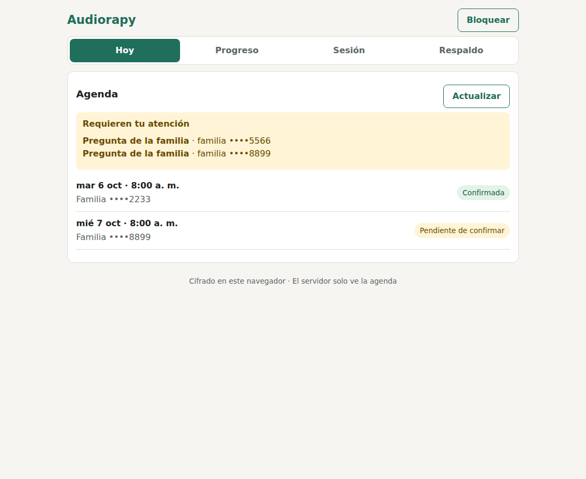
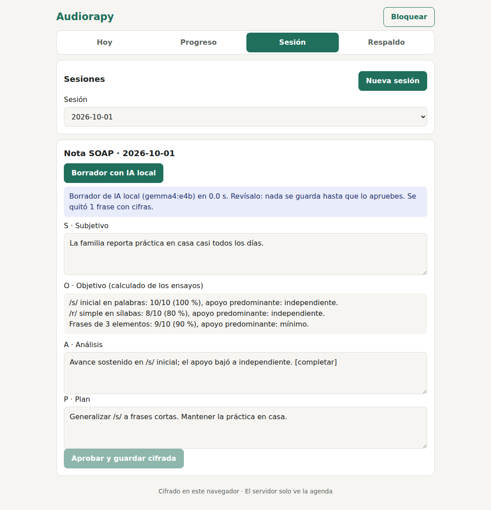
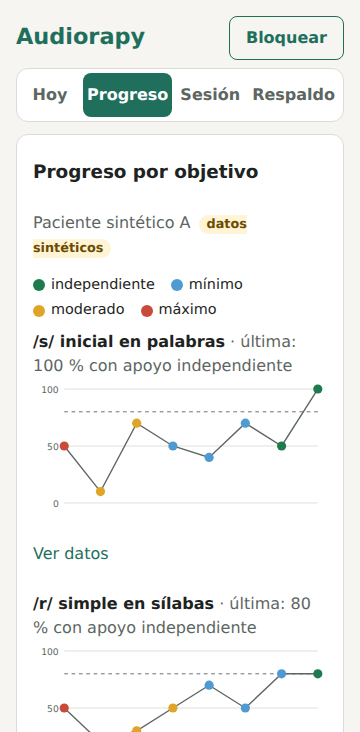

# audiorapy

A privacy-first assistant for a home-visit speech-language therapist (fonoaudióloga) in Colombia:
WhatsApp scheduling and reminders, session tracking with cue levels, and a web dashboard — with an
open-weight model (Gemma 4 via Ollama) doing the AI work on hardware she controls, so clinical notes
about children never leave her devices.

Built for the [DEV Hacktoberfest Weekend Challenge: Build for a Friend](https://dev.to/challenges/hacktoberfest-weekend-2026-10-01)
(window: 2026-10-02 02:00 UTC → 2026-10-05 06:59 UTC).

> Status: building. Weekend MVP in progress — see [docs/plan.md](docs/plan.md) for what is done and what is pending.

## Quick start

```bash
npm ci
npm run verify        # typecheck, lint, format, unit + fuzz + invariant tests, build
npm run test:unit     # each test folder also runs on its own
npm run test:fuzz
npm run test:invariant
npm run test:e2e      # Playwright, see below
```

Run the API locally (console channel: replies are kept in memory instead of sent to WhatsApp):

```bash
DASHBOARD_TOKEN=dev npm run dev:api
curl -s -X POST localhost:3000/dev/simulate -H 'content-type: application/json' \
  -d '{"from":"573001112233","text":"Hola"}'
npm run smoke:api     # starts the real process and checks webhook guards + booking over HTTP
```

| Endpoint | What it does |
|---|---|
| `GET /webhook` | Meta subscription handshake; 403 on a wrong verify token, 503 when none is configured |
| `POST /webhook` | Signed Meta deliveries: HMAC-SHA256 over the raw bytes, 401 when it does not match, dedupe by message id |
| `GET /health/providers` | Which channel, intent classifier, risk model and scheduler are active, and the last model result |
| `GET /api/agenda` | Appointments and therapist alerts (bearer `DASHBOARD_TOKEN`; phone numbers masked) |
| `POST /api/reminders/tick` | Runs the reminder cron once (it also runs every minute) |
| `POST /dev/simulate` | Development only, console channel only: feed a caregiver message through the real pipeline |

Run the therapist dashboard (decrypts in the browser; works without the API or Ollama):

```bash
npm run dev:web       # http://localhost:5173
npm run test:e2e      # Playwright: builds the dashboard, starts the real API, runs mobile + desktop
```

| Today (scheduling plane, phones masked) | SOAP note (local Gemma draft, figures computed by code) | Progress by cue level (synthetic data) |
|---|---|---|
|  |  |  |

The screenshots use synthetic data and a mocked Ollama reply; no real patient appears anywhere in this repo.

Requires Node 22+. Copy `.env.example` to `.env` only when wiring real providers; everything runs
without it.

## Layout

| Path | What lives there |
|---|---|
| `packages/domain` | Pure TypeScript domain: ports, typed `PortResult`, no third-party SDKs |
| `apps/api` | WhatsApp webhook and scheduling API (Fastify): Meta and console channels, Gemma-on-Ollama intent with rules fallback, reminder cron |
| `apps/web` | Therapist dashboard (Vite + React): vault with passphrase + 24-word recovery phrase, today's agenda, progress by cue level, session mode, SOAP drafts from local Ollama, encrypted backup/restore. Strict CSP in the build |
| `test/` | `unit/`, `fuzz/`, `invariant/` (Vitest + fast-check) and `e2e/` (Playwright) |

## Docs

| File | What it answers |
|---|---|
| [docs/research-report.md](docs/research-report.md) | The full report (Spanish): weekend MVP vs roadmap, architecture, clinical data model and dashboards, zero-knowledge encryption under Colombian law, open-source AI core, sponsor categories with fallbacks, reuse from prior work, weekend plan |
| [docs/plan.md](docs/plan.md) | User story, acceptance criteria and build blocks with status (Spanish) |
| [docs/memoria.md](docs/memoria.md) | Architecture decisions and why (Spanish) |
| [docs/verificacion.md](docs/verificacion.md) | Dated evidence of what was verified and what is pending (Spanish) |
| [AGENTS.md](AGENTS.md) · [CLAUDE.md](CLAUDE.md) | Rules for coding agents working in this repo (Spanish) |
| [docs/research/](docs/research/) | The seven sourced research notes behind the report, including the official challenge page as primary source |

## Model input manifest

What each AI component sees — nothing else is sent to it.

| Component | Runs on | Sees | Never sees | Fallback |
|---|---|---|---|---|
| Intent classifier (Gemma 4 via Ollama) | Therapist's machine | The caregiver's free-text WhatsApp message (≤500 chars), which Meta already sees | Child name, clinical data | Deterministic Spanish rules (`classifyByRules`) |
| SOAP draft (Gemma 4 via Ollama, called from the dashboard) | Therapist's laptop, `localhost` | Target labels, correct/total counts, dominant cue level, the therapist's own short notes | Child name, age, address, diagnosis | Template note with `[completar]` |

The model never writes figures (any drafted sentence with a digit is replaced by `[completar]`), never
messages a caregiver (the bot only sends a fixed catalogue of templates and buttons), and every draft
stays `draft` until the therapist approves it.

## Prior work

Code ported from the author's earlier project [asegura](https://github.com/LuisAlejandroCR/asegura)
(WhatsApp channel adapter, webhook signature verification, conversation state machine) will be
credited here file by file, with the source commit and what changed.

## Post-deadline commits

None yet. Any commit after 2026-10-05 06:59 UTC will be listed here.

## License

[MIT](LICENSE)
